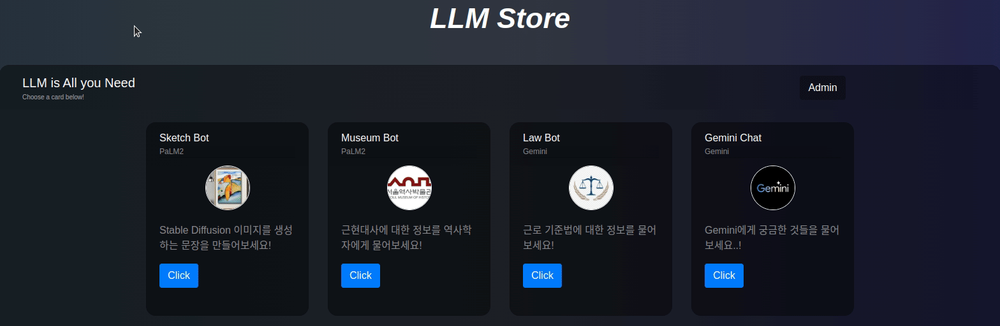
# LLM is All You Need

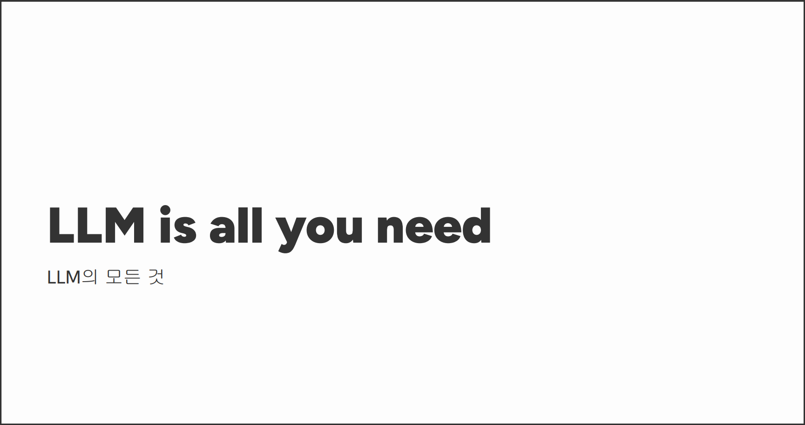 </img>


## 1. 목적
- Gemini를 이용하여 PDF를 업로드 후, RAG 구현하여 PDF에 있는 내용을 질의 (1차, 2차)
- Palm2를 이용하여 RAG 구성 (3차)
- Palm2, Gemini, Llama2 등 다수의 LLM 통합 작업 (4차)
- Docker를 통한 Deploy 편의성 제고 (5차)


## 2. 한줄 소개
- Langchain을 사용하여 LLM 모델인 Palm2, Gemini pro 및 Llama2의 RAG가 Flask위에서 구동 가능하고 Docker로 배포 자동화


## 3. 구성원
- DONGWEONSHIN
- Jeon0866 JinHwan
- wjseoduq


## 4. 프로젝트 기간
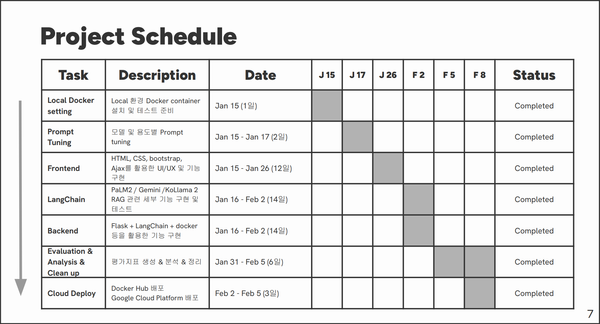 </img>
- 1차
- 2023.12.29 ~ 2024.1.5
- 2차
- 2024.1.15 ~ 2024.1.16
- 3차
- 2024.1.17 ~ 2024.1.26
- 4차
- 2024.1.29 ~ 2024.2.2
- 5차
- 2024.2.5 ~ 2024.2.16


## 5. 실행 방법 (통합)
1. 환경 설정을 위한 env 파일 만들기
```
mv .env.local .env
```

2. .env 파일에 'GOOGLE_API_KEY' 등 필요한 API 키 등록하기
```
# Google AI Gemini
GOOGLE_API_KEY=XXXXXXXXXXXXXXXXXXXXXXXXXxx
```

3. 필수 프로그램 설치하기 (CPU version)
```
pip install -r requirements.txt
```

4. 플라스크 구동하기
```
flask run
```
5. 구동된 화면
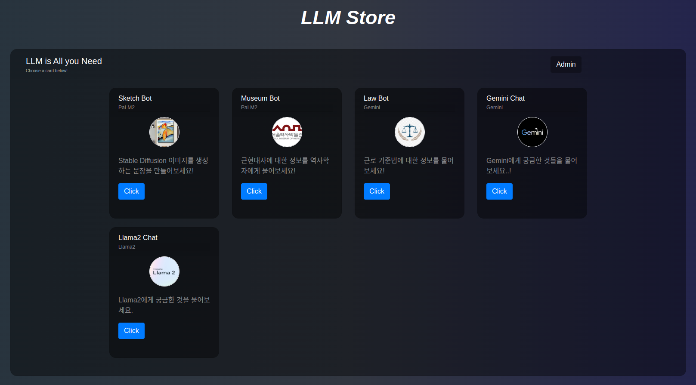


### 5.1 각 모델별 단독 실행 시 수정해야 할 것(PaLM2, Gemini 1.0 Pro, Llama2)
1. .env 파일에서 FLASK_APP의 타겟을 필요한 LLM으로 변경하기
```
FLASK_APP=app_PaLM2.py
```


### 5.2 PaLM2 모델 사용시 Vertex AI init 방법 (gcloud CLI에서)
1. gcloud CLI 설치

- https://cloud.google.com/sdk/docs/install?hl=ko#linux

````
gcloud init
````

2. auth 확인

- https://cloud.google.com/python/docs/setup#linux

````
gcloud auth application-default login
````


### 5.3 Llama2 모델 다운 받기
````
https://huggingface.co/LDCC/LDCC-SOLAR-10.7B
https://huggingface.co/TheBloke/Llama-2-13B-chat-GGUF
````


## 6. 폴더 구조
```
├── docker
│   ├── Dockerfile.cuda11_3_cudnn8
│   └── init.sh
├── IMG
├── LLM_DOC
│   ├── 프로젝트 제안서.docx
│   └── LLM is all you need 프로젝트 시간표.xlsx
├── PDF_DN_FOLDER
├── static
│   ├── chat.js
│   └── style.css
├── templates
│   ├── admin.html
│   ├── diffusion.html
│   ├── gemini.html
│   ├── index.html
│   ├── law.html
│   ├── llama.html
│   └── museum.html
├── test_pdf
│   ├── Korean_Ancient_History.pdf
│   ├── Labor_law.pdf
│   └── stable_diffusion_prompt.pdf
├── .env
├── .gitignore
├── app_Gemini.py
├── app_Llama2.py
├── app_PaLM2.py
├── app.py
├── ggml-model-f16.gguf
├── llama-2-13b-chat.Q5_K_M.gguf
├── model_Gemini.py
├── model_Llama2.py
├── model_Palm2.py
├── prompt_changes.txt
├── README.md
├── requirements.txt
├── text_Similarity.py
├── ver1_app.py
└── ver1_requirements.txt
```


## 7. app.py 주요 호출 함수
예) http://127.0.0.1:5000/chat
1. **/**
- flask를 실행하면 기본적으로 호출 되며, inedex 화면을 보여 준다.
2. **/chat**
- 입력창에 질의를 입력 하면 각각의 LLM과 대화를 한다.
3. **/savePdf**
- PDF 파일을 선택 하고 저장 한다.
4. **/chatWithPdf**
- 저장된 PDF를 기반으로 질의를 한다.


## 8. 진행 상황 중 극복 과제
### 8.1 Google AI Gemini 와 Langchain으로 RAG 구성 (문제점 포함)
1. 2023년 12월에 출시된 Gemini는 Google AI Gemini와 Vertext AI Gemini 버전 2가지가 있습니다.
2. 각각의 버전은 코드가 동일하지 않고, 현재 (2024년 1월 기준) 샘플 코드가 많지 않습니다
3. LangChain도 Gemini를 대응하기 위한 샘플 코드가 적고, 그나마 기본적인 코드만 존재 합니다.
4. 1차 RAG 시도 시 버전은 아래와 같습니다.
```
langchain==0.0.353
google-generativeai==0.3.2
langchain-google-genai==0.0.5
```
5. 1차 RAG 시도시에는 PDF 업로드 후, PDF 내용을 질의 하면 10번중 1번만 응답을 합니다.
6. 1차 파일을 기록을 남기고자 아래의 파일을 접두어 'ver1_'를 추가하여 변경합니다
```
app.py
requirements.txt
```


### 8.2 Google AI Gemini 와 Langchain으로 RAG 구성 (성공)
1. 2차 시도 버전은 아래와 같습니다.
```
langchain==0.1.0
google-generativeai==0.3.2
langchain-google-genai==0.0.6
```
2. 벡터 스토어를 FAISS로 변경 하고, retriever와 chain을 단순화 하여 수정하였습니다.
3. Google AI Gemini 코드와 Vertext AI Gemini를 인지하고 Google AI Gemini로만 진행 하였습니다.
4. RAG 구성을 완료 하고 PDF 업로드 후 질의 하면, PDF의 내용에 대해 답을 합니다.
5. 1차 때 구성한 내용들을 바탕으로 필요한 Gemini 샘플 코드를 분류 하여 분석 하였고, 임베딩과 질의, 벡터 스토어의 개념을 재학습 하였습니다. 그리고 Langchain의 버전이 그나마 안정화 되어 2차 때 RAG가 성공한 요인으로 파악 됩니다.
6. 테스트를 위해 postman을 사용하여 테스트 하였음


### 8.3 Palm2에 RAG 구성 (성공)
1. 아래의 사항을 추가 합니다.
```
google-cloud-aiplatform==1.39.0
langchain-google-vertexai==0.0.1
```
2. Palm2 모델을 사용시 .env의 타겟을 변경 합니다. ("Palm2 실행 시 추가사항" 부분 참고)
3. langchain-community 0.0.12에서 사용하던 VertexAIEmbeddings class가 사라질 예정이라 수정이 필요 했음
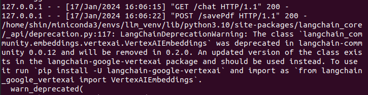


### 8.4 Llama2 추가 및 LLM 통합 작업 (완료)
1. 프론트에서 "model_type"을 지정해야 합니다.
2. model_type에는 아래와 같은 모델을 지정 할 수 있습니다.
```
# MODEL_TYPE = "PALM2"
# MODEL_TYPE = "GEMINI"
# MODEL_TYPE = "LLAMA2"

MODEL_TYPE = request.form["model_type"]
```
3. Llama2 모델 추가


### 8.5 Docker를 사용한 Deploy 작업

1. Debian bullseye 버전의 Docker 이미지에서 python 3.10을 설치 한 후 CUDA 11.8을 설치를 시도 하였으나, 의존성 문제가 있어서 설치가 안됨

2. 기 설치된 cuda 11.3과 cunnd8의 nvidia/cuda Docker 이미지를 사용하여 필수 프로그램 설치 및 환경 설정 추가 - (init.sh 참고)

3. 만들어진 Docker image를 Snapshot을 만들어 GCP의 Artifact Registry에 저장

4. Deploy 시 GCP의 VM 인스턴스에서 머신 할당

5. Docker pull 하여 기 등록된 Snapshot을 Docker Container에 추가

```
# docker 처음 시작 시 (GCP에서 T4 4장인 경우)
# tag 번호를 꼭 확인 할 것 !!

(base) dongweon_shin@docker-pull-tag-05-llm-instance-1:~$ docker run -it -p 5000:5000 --name "llm-gpu-docker" --runtime=nvidia --gpus all \
    --device=/dev/nvidiactl \
    --device=/dev/nvidia0 \
    --device=/dev/nvidia1 \
    --device=/dev/nvidia2 \
    --device=/dev/nvidia3 \
    us-central1-docker.pkg.dev/proj-team-3/llm-is-all-you-need-container-dev-repo/llm-is-all-you-need:tag-gpu-04 /bin/bash
```

```
# docker를 재시작 시 - 컨테이너 시작 방법

(base) dongweon_shin@docker-pull-tag-05-llm-instance-1:~$ docker container start llm-gpu-docker
llm-gpu-docker
```
```
# docker를 재시작 시 - 접속 방법

(base) dongweon_shin@docker-pull-tag-05-llm-instance-1:~$ docker attach llm-gpu-docker
```

6. Docker image 안에서 아래와 같이 실행
```
(base) root@d500e4945ecd:/# cd ~/my_ws/llm_is_all_you_need/
(base) root@d500e4945ecd:~/my_ws/llm_is_all_you_need# flask run -h 0.0.0.0 -p 5000
```

7. (옵션) 개발 서버에서 처음 Docker를 만들 때
```
# host os에서 (처음 도커 만들 때)
cd ./docker

# (수정 필요)
docker build -t llm-base:0.1 ./

docker run -it --runtime=nvidia --gpus all \
    --device=/dev/nvidia-uvm \
    --device=/dev/nvidia-uvm-tools \
    --device=/dev/nvidia-modeset \
    --device=/dev/nvidiactl \
    --device=/dev/nvidia0 \
    --device=/dev/nvidia1 \
    llm-base:0.1 /bin/bash
```

```
# Docker 안에서
apt-get update
apt-get install -y vim

vi ~/init.sh
(COPY)
. ~/init.sh
```


## 개발 중인 사항
1. 화면에서 PDF 업로드 후 질의를 시작하기 위해 js에서 /chatPdf로 함수를 변경해서 호출 해야 함
2. 화면 UI/UX를 변경할 예정임 -(완료)
3. 평가 지표 작업 중 - (완료)


## 시스템 아키텍처
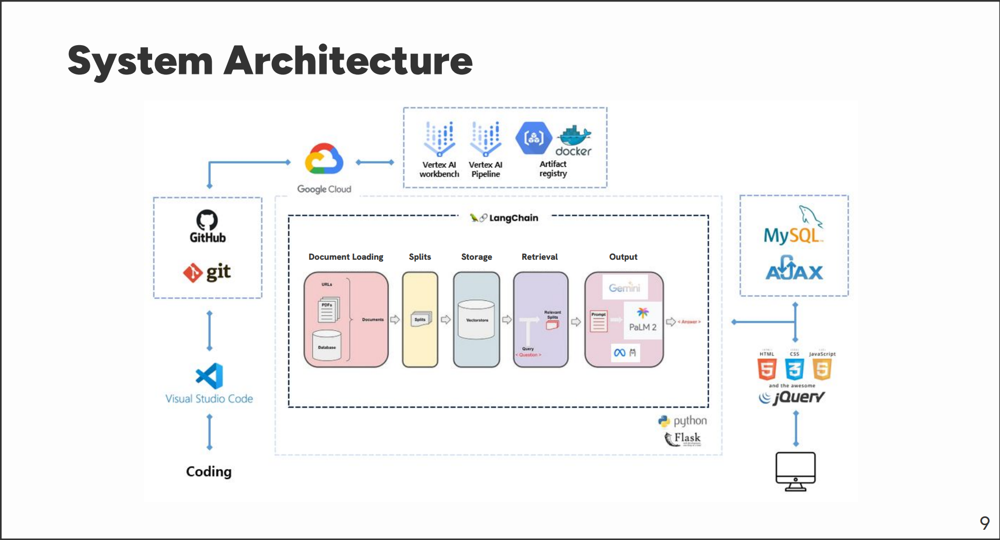 </img>


## RAG
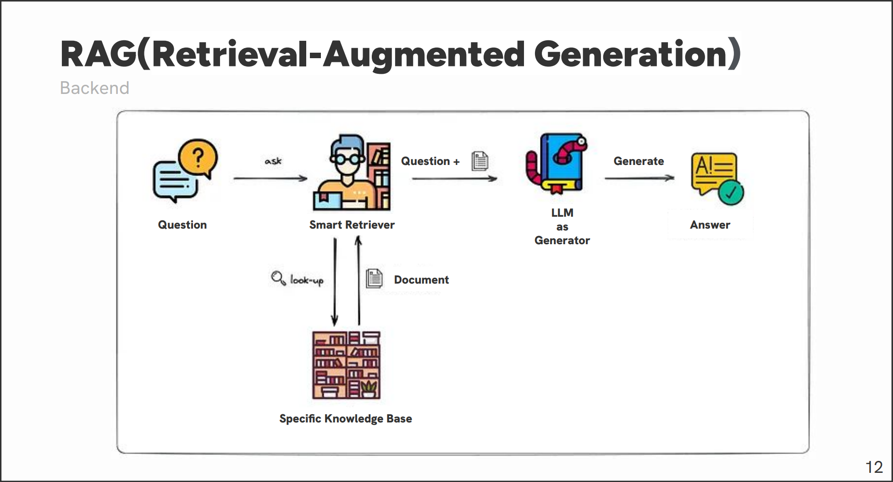 </img>
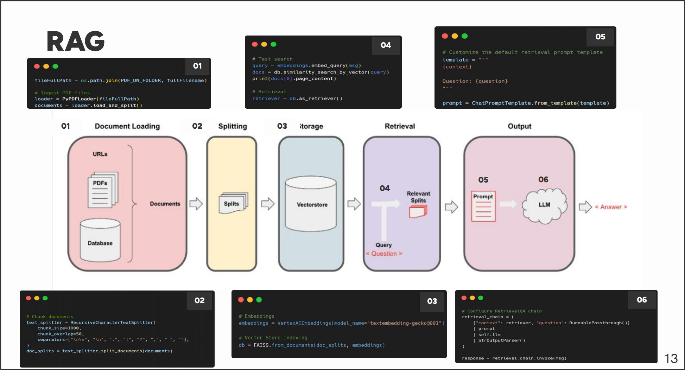 </img>


## 프롬프트 튜닝 및 테스트
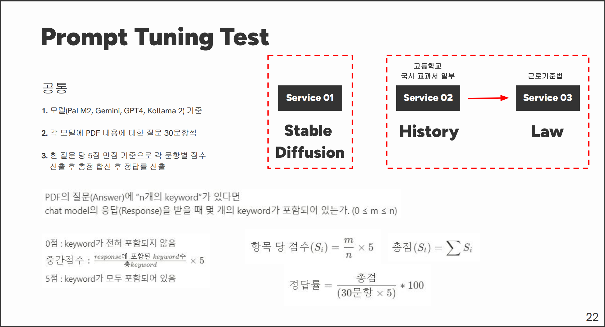 </img>
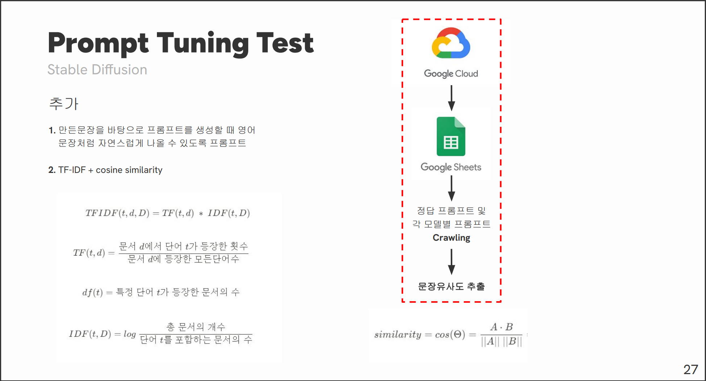 </img>


## 결론
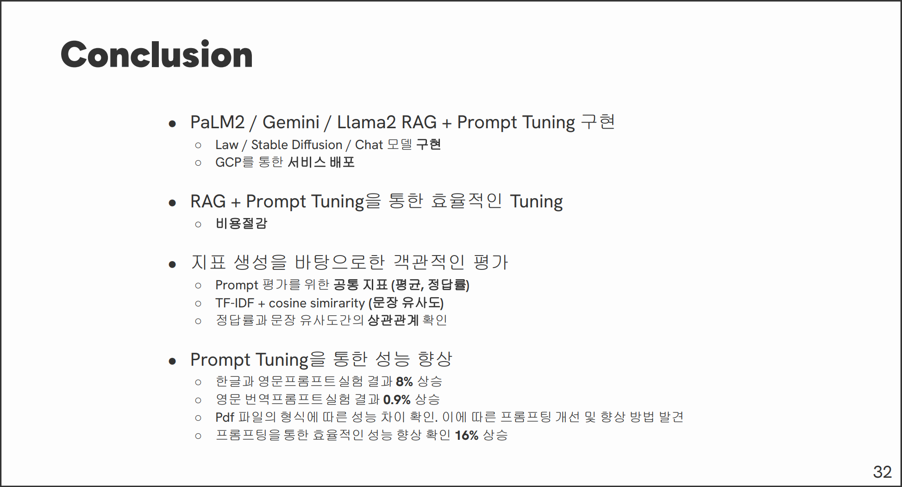 </img>


